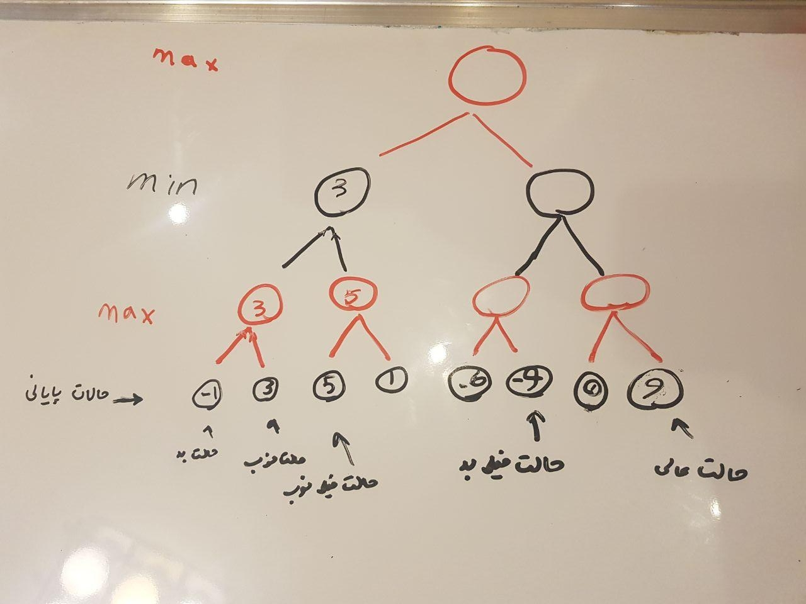

# session3: MinMax algorithm
+ min-max
+ minimax
+ saddle point (نقطه زینی)

### recursion
+ review fib: fib(n) use fib(n-1) and fib(n-2)
+ solve smaller problem(s) in order to solve big problem 
+ base case: we already know the answer for the small problem
+ more: [wikipedia](https://en.wikipedia.org/wiki/Recursion_(computer_science))


### backtracking
+ not related to kali linux and hack stuff
+ some kind of algorithm
+ explore all possible situations
+ not optimal, but still could be useful
+ use recursion (in DFS order)
+ for example 
    1. explore all combinations to solve a Sudoko
    2. N-queen 
    3. maze solving 
    4. finding all sub-sets
+ more: [backtracking](https://en.wikipedia.org/wiki/Backtracking)


### two-player game(!)
+ chess for instance
+ each player try to win
+ they **do best to win** -> play optimum
+ red turn, black turn, red turn, black turn
+ each turn, player try to **maximaze** chance of win (minimaze chance of loss!).
+ what is chance of win? in chess we can calculate it.
+ we can use minimax to maximaze our chance of win and develop some AI


### minimax
+ AI for two player games
+ originally developed for "zero sum" games.
+ main version good enough for tic-tac-toe (XO)
+ it could be useful for chess, back 
+ try to minimze **maximum loss**
  + in the other words: we try to win if other player play optimum
  + we assume that other players plays really well, we want to increase  our chance 


```pascal
function minimax(node, depth, maximizingPlayer) is
    if depth = 0 or node is a terminal node then
        return the heuristic value of node
    if maximizingPlayer then
        value := −∞
        for each child of node do
            value := max(value, minimax(child, depth − 1, FALSE))
        return value
    else (* minimizing player *)
        value := +∞
        for each child of node do
            value := min(value, minimax(child, depth − 1, TRUE))
        return value


(* Initial call *)
minimax(origin, depth, TRUE)
```

+ more: [wikipedia](https://en.wikipedia.org/wiki/Minimax)
+ even more: [game theory](https://en.wikipedia.org/wiki/Game_theory) and [nash equilibrium](https://en.wikipedia.org/wiki/Nash_equilibrium)


+ example



